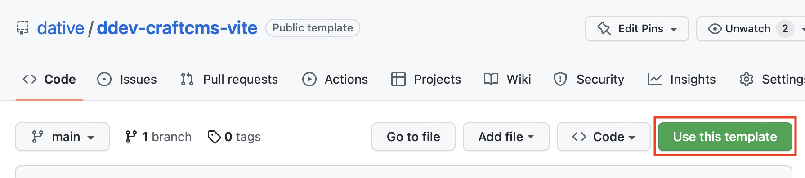

# ddev-craftcms-vite

This repository is a template for [DDEV](https://ddev.readthedocs.io/en/stable/) + [CraftCMS](https://craftcms.com/docs/4.x/) + [Vite](https://vitejs.dev) project for local development.

You can create a new repo from this one by clicking the template button in the top right corner of the page.

## Components of the repository

- The base setup to run CraftCMS + Vite with DDEV
- Github actions setup for building an deploying the site in Forge.

## Getting started

After cloning your new repo:

1. Create the new template repository by using the template button.
2. Clone the new repository to your local machine.
3. Replace `<craft-vite>` in `.ddev/confi.yaml` with your local project name.
4. Start DDEV with `ddev start`.
5. Run `ddev install-craft` to install CraftCMS.

## DDEV & Craft Setup

DDEV is configured with the following settings:

- PHP 8.1
- MySQL 8.0
- Node 16

Craft is configured with the following plugins:

- mailgun
- redactor
- blur-hash
- empty-coalesce
- retour
- seomatic
- typogrify
- vite
- relax
- typedlinkfield
- dospaces
- navigation
- super-table

## Usage

### Local development

### Build / Deploy

